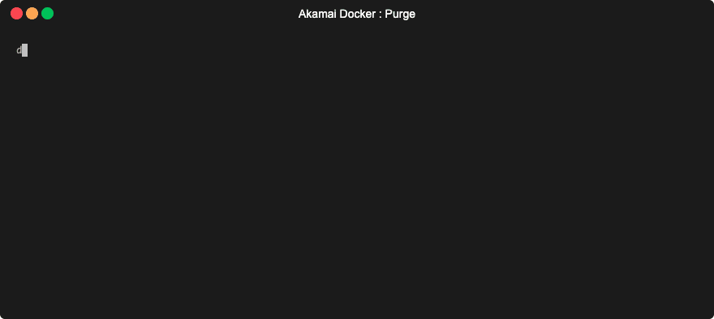

# Akamai Docker Development Environment

[](https://github.com/akamai/akamai-docker/actions)

> Run Akamai command line tools in docker. See the [tutorial](docs/TUTORIAL.md) for more usage examples.



## Quickstart

Enter a shell with all the tools (skip to [Authentication](#Authentication) for a refresher on `.edgerc`):

```bash
docker run --rm -it -v $HOME/.edgerc:/root/.edgerc:ro akamai/shell
```

Purge a CP Code:

```bash
docker run --rm -it -v $HOME/.edgerc:/root/.edgerc:ro akamai/shell akamai purge invalidate --cpcode 123456
```

Purge a CP Code (using the slim variant):

```bash
docker run --rm -it -v $HOME/.edgerc:/root/.edgerc:ro akamai/purge akamai purge invalidate --cpcode 123456
```

Start a long-running container in the background, execute commands against:

```bash
docker run -d --name akshell -v $HOME/.edgerc:/root/.edgerc:ro akamai/shell sleep infinity
docker exec -it akshell akamai purge invalidate --cpcode 123456
```

## About The Images

This project provides images in two flavors:

* small, single tool images

  *Good choices for integrating exactly what you need in automation.*

* larger image combining them all (shell)

  *Perfect for experimentation or automation when all-in-one is more convenient.*

## Variants

| REPOSITORY                    | SIZE   | DOCS                                                                       |
|-------------------------------|--------|----------------------------------------------------------------------------|
| akamai/shell                  | 403MB  | [GitHub](https://github.com/akamai/akamai-docker)                          |
| akamai/terraform              | 48.4MB | [GitHub](https://github.com/terraform-providers/terraform-provider-akamai) |
| akamai/terraform-cli          | 14.7MB | [GitHub](https://github.com/akamai/cli-terraform)             |
| akamai/httpie                 | 45.2MB | [GitHub](https://github.com/akamai/httpie-edgegrid)                        |
| akamai/sandbox                | 158MB  | [GitHub](https://github.com/akamai/cli-sandbox)                            |
| akamai/purge                  | 14.1MB | [GitHub](https://github.com/akamai/cli-purge)                              |
| akamai/property-manager       | 64.3MB | [GitHub](https://github.com/akamai/cli-property-manager)                   |
| akamai/onboard                | 99.7MB | [GitHub](https://github.com/akamai/cli-onboard)                            |
| akamai/image-manager          | 46.7MB | [GitHub](https://github.com/akamai/cli-image-manager)                      |
| akamai/jsonnet                | 48.5MB | [GitHub](https://github.com/akamai-contrib/cli-jsonnet)                    |
| akamai/firewall               | 45.5MB | [GitHub](https://github.com/akamai/cli-firewall)                           |
| akamai/eaa                    | 45.3MB | [GitHub](https://github.com/akamai/cli-eaa)                                |
| akamai/edgeworkers            | 58.2MB | [GitHub](https://github.com/akamai/cli-edgeworkers)                        |
| akamai/dns                    | 14.2MB | [GitHub](https://github.com/akamai/cli-dns)                                |
| akamai/cps                    | 46.2MB | [GitHub](https://github.com/akamai/cli-cps)                                |
| akamai/cloudlets              | 45.5MB | [GitHub](https://github.com/akamai/cli-cloudlets)                          |
| akamai/appsec                 | 56.6MB | [GitHub](https://github.com/akamai/cli-appsec)                             |
| akamai/api-gateway            | 21.1MB | [GitHub](https://github.com/akamai/cli-api-gateway)                        |
| akamai/adaptive-acceleration  | 45.2MB | [GitHub](https://github.com/akamai/cli-adaptive-acceleration)              |
| akamai/etp                    | 49.1MB | [GitHub](https://github.com/akamai/cli-etp)                                | 
| akamai/gtm                    | 14.2MB | [GitHub](https://github.com/akamai/cli-gtm)

All variants use an Alpine Linux base.

The `akamai/shell` image replaces the previous `akamai/akamai-docker` image, and contains all the other variant images plus some extra utilities:

* git
* vim
* tree
* bind-tools
* jq
* jsonnet

## Tags

We publish two tags for each image:

* `latest`: built when a commit is pushed to `master`
* `vX.X.X`: built when new version is released

## General Usage

> This section describes how to operate the docker images. Please find detailed usage instructions for each tool linked in the [variants table](#Variants).

### Authentication

The standard authentication method for most Akamai APIs is called EdgeGrid. Creating an EdgeGrid client is covered on [developer.akamai.com](https://developer.akamai.com/api/getting-started).

You will typically create an `.edgerc` file in your home directory with contents similar to this:

```ini
[default]
client_secret = your_client_secret
host = your_host
access_token = your_access_token
client_token = your_client_token
```

The following example illustrates this by displaying the list of groups using the Akamai CLI Property Manager package ("pm" is an alias for "property-manager" and "lg" is an alias for "list-groups"):

```bash
docker run -it --rm -v $HOME/.edgerc:/root/.edgerc:ro akamai/shell akamai pm lg
```

Mounting the file read-only (`:ro`) is also recommended to protect your credentials from corruption or tampering.

### Short-lived Container

> Good for interactive exploration of APIs

```bash
docker run --rm -it -v $HOME/.edgerc:/root/.edgerc:ro akamai/shell
```

Tip: You can store this command on a shell alias which allows to start the Akamai Development Environment with a single command like `akadev`:

```bash
alias akadev='docker run --rm -it -v $HOME/.edgerc:/root/.edgerc:ro akamai/shell'
```

### Long-Running Container

> Good for interactive tools that run commands at regular intervals, like Jenkins pipelines

Run the container in the background:

```bash
docker run -d --name akshell -v $HOME/.edgerc:/root/.edgerc:ro akamai/shell sleep infinity
```

Then execute commands using `docker exec`.

```bash
docker exec -it akshell akamai purge invalidate --cpcode 123456
```

You can stop and start this container by running:

```bash
docker stop akshell
docker start akshell
```

### One-Shot Container

> Good for occasional interactive use, like ephemeral tool automation

The example below invalidates a cached image on the Akamai production network (default)

```bash
docker run --rm -v $HOME/.edgerc:/root/.edgerc:ro akamai/purge akamai purge invalidate http://www.example.com/logo.png
```

## Image Specifics

Some images require special handling in docker.

### Terraform

Because the docker container will be running with `/` as the working directory, you cannot simply mount your configuration and run `terraform apply`.

The easiest approach is to specify the mount path in the container as an argument to terraform commands:

```bash
docker run --rm -v $HOME/.edgerc:/root/.edgerc:ro \
  -v $HOME/terraform-config:/tf:ro \
  akamai/terraform \
    terraform apply /tf
```

#### Terraform >=0.13.0

Since 0.13, Terraform requires [providers to be declared](https://www.terraform.io/upgrade-guides/0-13.html#explicit-provider-source-locations)
and pinned to a specific version. The Akamai docker image bakes in a few commonly-used provider plugins, in addition to the Akamai provider.

You can use the [terraform.tf](files/terraform.tf) file we use as reference if you wish to include these pre-baked plugins in your project.

If those providers are enough for your requirement, then you're all set. If you need more providers, be advised that `terraform init` will by
default install the providers in a folder within the container, which you will lose along with the container.

In that case, you may wish to install them yourself in a location of your choosing. To do this, simply set the `TF_PLUGIN_CACHE_DIR` environment
variable to the appropriate location. For example:

```bash
docker run --rm -v $HOME/.edgerc:/root/.edgerc:ro \
  -v $HOME/terraform-config:/tf:ro \
  -v $HOME/terraform-plugin-cache:/tf-plugins:rw \
  -e TF_PLUGIN_CACHE_DIR=/tf-plugins \
  akamai/terraform \
    terraform init /tf
```

### HTTPIE

When using HTTPIE non-interactively in docker (without `-it`), you may wish to read the [Scripting Best Practices](https://httpie.org/docs#best-practices) section of the documentation.

### Sandbox

> *Note: Credits go to Nick Le Mouton for his awesome blog post: <https://www.noodles.net.nz/2018/10/12/running-akamai-sandbox-in-docker-with-https/>*

Assuming you run a webserver locally on port 5000 and sandbox is exposed on port 9550:

* ensure you run docker with port mapping:

  ```bash
  docker run -it -p 9550:9550 --name mylab akamai/akamai-docker
  ```

* set up sandbox client to listen on address `0.0.0.0`:

  ```json
  "sandboxServerInfo": {
    "secure": false,
    "port": 9550,
    "host": "0.0.0.0"
  },
  ```

* setup origin mapping using a special docker hostname:

  ```json
  "originMappings": [
    {
      "from": "",
      "to": {
        "secure": false,
        "port": 5000,
        "host": "host.docker.internal"
      }
    }
  ],
  ```

### Non-Interactive Sandbox

The above use case assumes that user starts bash sessions and invokes commands inside of it. However, it's also possible to use this docker image to execute commands straight like on the following example:

```bash
❯ docker run -it --rm -p 9550:9550 -v $HOME/.edgerc:/root/.edgerc -v $(pwd)/sandbox:/cli/.akamai-cli/cache/sandbox-cli akamai/akamai-docker akamai sandbox list
Local sandboxes:

current  name      sandbox_id
-------  --------  ------------------------------------
YES      username  11111111-222-3333-4444-555555555555
```

This way, the container is immediately removed when the execution is complete. You can use path mount - like in the example above - to persist state across multiple commands invocations. The example above stores *sandbox-cli* local data in `$(pwd)/sandbox` subfolder so it's possible to operate on the same sandbox like in a single bash session.

## Build

The build system is described at length in [docs/BUILD.md](docs/BUILD.md).

## Tutorial

You can find further usage examples on [docs/TUTORIAL.md](docs/TUTORIAL.md).

## License

Copyright 2020 Akamai Technologies, Inc.

See [Apache License 2.0](LICENSE)

By submitting a contribution (the “Contribution”) to this project, and for good and valuable consideration, the receipt and sufficiency of which are hereby acknowledged, you (the “Assignor”) irrevocably convey, transfer, and assign the Contribution to the owner of the repository (the “Assignee”), and the Assignee hereby accepts, all of your right, title, and interest in and to the Contribution along with all associated copyrights, copyright registrations, and/or applications for registration and all issuances, extensions and renewals thereof (collectively, the “Assigned Copyrights”). You also assign all of your rights of any kind whatsoever accruing under the Assigned Copyrights provided by applicable law of any jurisdiction, by international treaties and conventions and otherwise throughout the world.
